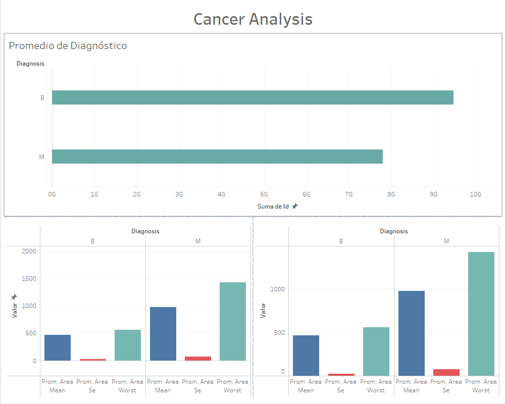

# Big Data
Módulo 1 Utilización, procesamiento y visualización de grandes volúmenes de datos

El panel superior fue diseñado considerando dos elementos clave en el diagnóstico del cáncer, elegidos por su frecuente mención durante las revisiones: el área y el perímetro promedio del seno, factores que pueden variar entre individuos. Estos criterios permiten discernir entre casos benignos y malignos, ofreciendo una visión relevante sobre la naturaleza de los casos.

Adicionalmente, se presenta un gráfico que resume los diagnósticos totales, distinguiendo entre benignos y malignos. Esta representación gráfica brinda al usuario una visualización clara de la distribución de casos de cáncer de mama en nuestro conjunto de datos.
